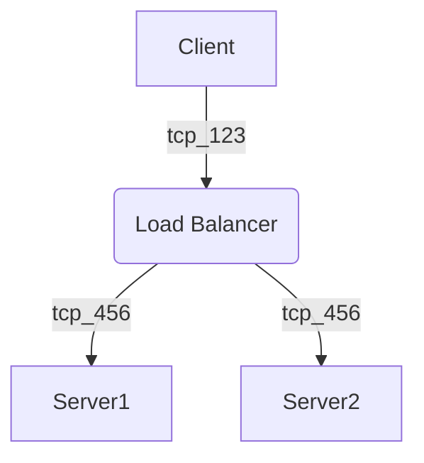

此文章系Hugo以及Anatole主题所支持的Markdown语法规则参考及演示

<!--more-->

## 标题

同常规Markdown语法一样，依次提供 `<h1>`—`<h6>` HTML标签。

# H1
## H2
### H3
#### H4
##### H5
###### H6

## 段落

也和常规Markdown语法一样。比如这里是一段话。

空一行后的这里是另一段话。  
不空行并在句末加两个空格为另起一行。

## 引用

Anatole支持两种方式的引用，即附带注释和不带注释的引用。

#### 不带注释的引用

> 这是一段引用  
> **注意：** 你可以在引用中使用 *Markdown语法标记* 。

#### 附带注释的引用

> 度尽劫波兄弟在，相逢一笑泯恩仇。<br>
> — <cite>鲁迅 [^1]</cite>

[^1]: 这句话出自鲁迅的[《题三义塔》](https://so.gushiwen.cn/shiwenv_7917bc0ef7c4.aspx) ，作于1933年6月21日。

## 列表

和常规Markdown列表语法基本相同。

#### 有序列表

1. 第一项
2. 第二项
3. 第三项

#### 无序列表

* 有一个列表项
* 另一个列表项
* 第三个列表项

#### 层级列表

* 水果
  * 苹果
  * 橘子
  * 香蕉
* 清单
  * 牛奶
  * 鸡蛋

## 代码

```html
<!doctype html>
<html lang="en">
<head>
  <meta charset="utf-8">
  <title>Example HTML5 Document</title>
</head>
<body>
  <p>Test</p>
</body>
</html>
```

## 表格

表格并不是Markdown基础语法的一部分，但是Hugo原生支持建立表格，并且可以在表格中使用Markdown语法。

| 斜体       | 粗体     | 代码    |
| --------  | -------- | ------ |
| *italics* | **bold** | `code` |

## 科学公式

Anatole支持使用KaTeX渲染科学公式。

全局启用KaTeX：在`params.toml`中设置：`[math]enable = false use = "katex"`

单页启用KaTex：在Front Matter中设置：`math: true`

可以使用行内公式：\\(E=mc^2\\) 

也可以渲染复杂的公式，比如：

<div>
\[ \int u \frac{dv}{dx}\, dx=uv-\int \frac{du}{dx}v\,dx \]
</div>


矩阵：

<div>
\[ \begin{pmatrix} a&b\\c&d \end{pmatrix} \quad
\begin{bmatrix} a&b\\c&d \end{bmatrix} \quad
\begin{Bmatrix} a&b\\c&d \end{Bmatrix} \quad
\begin{vmatrix} a&b\\c&d \end{vmatrix} \]
</div>

多行公式：

<div>
\[\begin{aligned}
x ={}& a+b+c+{} \\
&d+e+f+g
\end{aligned}\]
</div>

## 图表

Anatole支持使用Mermaid渲染图表。为了能够正确渲染表格、图表和流程图，请确保`config.toml`中的`markup.goldmark.renderer.unsafe`的值为true，`params.toml`中设置`[mermaid]enable = true`

Mermaid流程图渲染示例:



## 其他元素——缩写，脚标，角标，键盘按键，高亮标记

<abbr title="Graphics Interchange Format">GIF</abbr>是一种位图图片格式。

H<sub>2</sub>O

X<sup>n</sup> + Y<sup>n</sup> = Z<sup>n</sup>

按下<kbd><kbd>CTRL</kbd>+<kbd>ALT</kbd>+<kbd>Delete</kbd></kbd>以访问任务管理器。

大多数<mark>口腔癌</mark>都是由于不良的生活习惯导致的。

## 行内HTML和CSS

<svg class="canon" xmlns="http://www.w3.org/2000/svg" overflow="visible" viewBox="0 0 496 373" height="373" width="496"><g fill="none"><path stroke="#000" stroke-width=".75" d="M.599 372.348L495.263 1.206M.312.633l494.95 370.853M.312 372.633L247.643.92M248.502.92l246.76 370.566M330.828 123.869V1.134M330.396 1.134L165.104 124.515"></path><path stroke="#ED1C24" stroke-width=".75" d="M275.73 41.616h166.224v249.05H275.73zM54.478 41.616h166.225v249.052H54.478z"></path><path stroke="#000" stroke-width=".75" d="M.479.375h495v372h-495zM247.979.875v372"></path><ellipse cx="498.729" cy="177.625" rx=".75" ry="1.25"></ellipse><ellipse cx="247.229" cy="377.375" rx=".75" ry="1.25"></ellipse></g></svg>

[The Van de Graaf Canon](https://en.wikipedia.org/wiki/Canons_of_page_construction#Van_de_Graaf_canon)


<style>
.canon { background: white; width: 100%; height: auto; }
</style>


## 图片

Anatole支持使用不同的短代码渲染图像。默认图像使用Markdown标准语法：``

短代码示例如下，注意这些用例只在页面可视区宽度大于1300px时生效。











Pellentesque posuere sem nec nunc varius, id hendrerit arcu consequat. Maecenas commodo, sapien ut gravida porttitor, dolor risus facilisis enim, eget pharetra nibh nisl porttitor sapien. Proin finibus elementum ligula sit amet hendrerit. 



In a libero varius, luctus ligula et, bibendum tortor. Sed sit amet dui malesuada, mattis justo id, ultricies enim. Vestibulum ante ipsum primis in faucibus orci luctus et ultrices posuere cubilia Curae; Aliquam sollicitudin cursus feugiat. Vivamus suscipit ipsum eget lobortis sollicitudin. Fusce vehicula neque tellus. Integer eu posuere quam, id laoreet tortor. Mauris sit amet turpis urna. Donec venenatis tempor dolor, nec laoreet orci aliquet et. Sed condimentum elit eu tristique aliquam. Pellentesque habitant morbi tristique senectus et netus et malesuada fames ac turpis egestas. Nunc luctus ipsum sit amet nisl maximus pellentesque.



Pellentesque eu consequat nunc. Vivamus eu eros ut nulla dapibus molestie in id tortor. Cras viverra ligula erat, tincidunt hendrerit diam blandit nec. Cras id urna vel dolor dictum mattis. Vestibulum congue erat ac eros molestie accumsan. Maecenas lorem nibh, maximus vel justo eget, facilisis egestas lectus. Mauris eu est ut odio blandit consequat id feugiat eros. Fusce id suscipit mi, et lacinia lectus. Mauris a arcu placerat dolor iaculis feugiat nec non mi. Ut porttitor elit tortor, eget tempus velit mollis eu. Aliquam sem nulla, dictum cursus mauris ac, semper ullamcorper leo.

## 文章标题图

Anatole支持渲染文章标题图，需要在Front Matter中加入：`thumbnail: "images/xxx.jpg"`。

注意，如想完整显示标题图，完整尺寸（桌面端）应为750x240px，核心尺寸（移动端）应为350x240px。

## 通知

Anatole支持三种通知类型如下。

### 信息


Lorem ipsum dolor sit amet, consectetur adipiscing elit, sed do eiusmod tempor incididunt ut labore et dolore magna aliqua. Ut enim ad minim veniam, quis nostrud exercitation ullamco laboris nisi ut aliquip ex ea commodo consequat.


### 更新


Lorem ipsum dolor sit amet, consectetur adipiscing elit, sed do eiusmod tempor incididunt ut labore et dolore magna aliqua. Ut enim ad minim veniam, quis nostrud exercitation ullamco laboris nisi ut aliquip ex ea commodo consequat.


### 警告


Lorem ipsum dolor sit amet, consectetur adipiscing elit, sed do eiusmod tempor incididunt ut labore et dolore magna aliqua. Ut enim ad minim veniam, quis nostrud exercitation ullamco laboris nisi ut aliquip ex ea commodo consequat.


## 页面重定向

Anatole可以用过如下代码实现页面重定向。

Front Matter中加入：

```
redirectUrl="https://gohugo.io"
```
页面内加入：

```
Forwarding to [gohugo](https://gohugo.io) using 'redirectUrl'
{}
```